# Image Editor

By - [Vandit Gupta](https://www.linkedin.com/in/vandit-gupta/) and [Gargi Umrajkar](https://www.linkedin.com/in/gargi-umrajkar/)

### Course Information 

- *Course:* Programming Design Paradigm
- *Course Instructor:* [Prof. Amit Shesh](https://www.khoury.northeastern.edu/people/amit-shesh/)
- *Institution:* Northeastern University

## Introduction

This assignment, titled "Image Editor" is a Java project that implements a simple image editing
application following the Model-View-Controller (MVC) architectural pattern. The project comprises
various components, each serving a specific role in the application. This README provides an
overview of the key components and their functionalities.

## Components

### 1. ImageEditor

The "ImageEditor" class serves as the entry point for the image editing application. It sets up the
environment for users to interact with the program through text-based commands which are
entered in the console or the commands are executed through a text file. Image processing and
control are handled by the respective classes, "ImageOperatorImpl" and "ImageControllerImpl".

### 2. ImageController

The "ImageController" is an interface that defines methods for sending and executing commands
related to image operations via text parsing. It throws exceptions for invalid commands and
input/output issues. The ImageController also gives the user the option to execute a text file
containing a list of commands by passing the file path as an argument to the "run" method.
The user can also execute the commands directly from the console by passing the command as an
argument to the "run" method.

### 3. ImageOperator

The "ImageOperator" interface represents an image operator. It is only main model interface that the
controller has access to. It provides a comprehensive set of methods for loading, saving,
processing, and applying filters to images. These methods handle exceptions related to file
operations and image processing. Additionally, it offers features such as adjusting brightness,
combining images, splitting images into color channels, and retrieving image details using the
"ImageDetails" data structure.

### 4. ImageLoader

The "ImageLoader" interface focuses on loading images as "ImageDetails" and saving "ImageDetails" to
specified paths. It handles exceptions related to file operations, ensuring smooth image loading and
saving processes.

### 5. ImageDetails

The "ImageDetails" class encapsulates the details of an image, including its width, height, maximum
value, and the red, blue, and green color channels as 2D float arrays. It follows the Builder design
pattern, allowing structured creation of "ImageDetails" instances with customizable attributes. This
class provides a robust approach to managing and accessing image details.

### 6. ImageFilter

The "ImageFilter" interface is responsible for applying custom kernels as filters to modify images
represented by "ImageDetails." It includes methods for applying matrix kernels and linear kernels to
process input images and returns the processed image as "ImageDetails".

### 7. ImageProcessor

The ImageProcessor interface provides essential methods for image manipulation, including
visualizing individual color channels (red, green, blue), combining grayscale images into a
color image, flipping images horizontally or vertically, adjusting image brightness or darkness, 
and dithering an image. Additionally, it offers a unique function to visualize different color
representations like luma, intensity, and value, enhancing the analysis and manipulation of image 
data.

### 8. ImageHistogram

The ImageHistogram interface enables creation and manipulation of image histograms.
It provides methods for generating histograms, applying color correction and levels adjust on the 
image. It also includes methods for split view of the color correct and levels adjusted image.

### 9. ImageCompressor

The ImageCompressor interface is designed for compressing images. It provides the
method for compression, allowing users to reduce image file size while
maintaining varying degrees of image quality. The interface includes the method
compressImageLossy which reduces quality but offers higher compression rates. This interface is
crucial for managing image storage efficiently.

### 10. ImageView

The ImageView interface is responsible for displaying the image and the filtered image. It also
displays the error message if the image is not found. It also refreshes the histogram and adds the
features to the controller.

### 11. MockImageOperator

The ImageMockOperator class is a mock class that implements the ImageOperator interface. It is used
for testing the Controller and the model.

### 12. MockImageView

The MockImageView class is a mock class that implements the ImageView interface. It is used for
testing the Controller and the view.

## How to run the program

1. Run the main program in the "ImageEditor" class.
2. Enter the command in the console.
3. If the command starts with "-file", enter the path of the text file along with the
   "-file" command containing the list of commands.
4. If any other valid command is entered, the program will execute the command and prompt for
   another command.
5. If an invalid command is entered, the program will prompt for another command.
6. To exit the program, enter "exit" as the command.

### Run program using JAR file

1. Execute the JAR file in the res folder on the terminal by
   typing the following command: java -jar ImageProcessor.jar
2. Enter the commands in the console.
3. Run the command "-file commands.txt" to run the commands in the text file

## Overall flow of the program

1. The user enters a command in the console.
2. The command is parsed and validated.
3. If the command is valid, the program executes the command.
4. If the command is invalid, the program prompts for another command.
5. The program continues to prompt for commands until the user enters "exit" as the command.
6. The program exits.
7. If the user enters the "-file" command, the program executes the commands in the text file.
8. If the command is valid, it is passed onto the ImageController.
9. The command goes to the executeCommand method in the ImageController where the appropriate method
   in the appropriate class is called based on the command and further processing takes place.

## Changes made from Assignment 4 to Assignment 5

1. Added the ImageCompressor interface and ImageCompressorImpl class for implementing image
   compression.
2. Added the ImageHistogram interface and ImageHistogramImpl class for implementing image
   histogram generation and manipulation.
3. Modified the ImageOperator interface to include methods for image compression and histogram
   generation and manipulation.
4. Modified the ImageFilter interface to allow split view of images with filters applied.
5. Modified the ImageControllerImpl class to include methods for image compression and histogram
   generation and manipulation. Also added support for '-file' command which allows users to
   execute commands from a text file.
6. Changed Hashmap to Map in the ImageOperatorImpl class as suggested in the feedback.
7. Modified the ImageProcessorImpl class to combine 'VALUE', 'LUMA' and 'INTENSITY' color
   representations into a single method as suggested in the feedback.
8. Added ColorRepresentation enum which contains 'VALUE', 'LUMA' and 'INTENSITY' color
   representations.
9. The original design remained unchanged because it could integrate new classes and add new
   features without disrupting the functionality of existing classes.

## Changes made from Assignment 5 to Assignment 6

1. Added the view package which contains the ImageView interface and ImageViewImpl
   class for implementing the view components of the MVC architecture.
2. Added 2 more cases to the main function on how to run the program in the ImageEditor class.
   The first case which was already present was to run the program through commands in the console.
   The second case was modified to run the program using a text file containing a list of commands.
   The third case is the newly added one to run the program through the view.
   All of these can be performed by running the jar file.
3. The controller implementation was modified to include the view. The controller now has access to
   the view, it implements Features interface that has methods to apply filter, load image, save,
   and setView to controller.
4. The ImageView interface implements methods to display image, display filtered image, display
   error, refresh histogram, and add features.
5. Fixed the issues raised in Assignment 5 feedback. Fixed readme to include justification for 
   assignment 4 to 5 changes. Added appropriate citations for the images used in the readme. Logic
   for split kernelFilter and LinearFilter was fixed. 

## Assignment 7 - Dither Implementation 
#### (Implemented by [Dhruv Saini](https://www.linkedin.com/in/saini-dhruv/) and [Mumuksha Pant](https://www.linkedin.com/in/mumuksha-pant/))
 We were able to implement the dither correctly similar to assignment's requirement.
 Implemented the GUI feature for Dither along with support for split preview.
 script command - dither <src_image> <dest_image> <split_percentage>
 res/diya_dither.jpg is an image having dither that we have implemented
 steps :

1. First we have to understand the complete flow of the application, how the validations for the commands are working,
   how the MVC is configured, How the flow starts from controller, etc.
2. Once we have done the analysis of the team's implementation, We planned on adding the dither feature to support the
   scripts.
3. We first added test cases for testing the dither implementation.
4. We then added the dither methods to ImageOperation classes in models.
5. Then we added the dither implementation logic to the ImageProcessor classes in model.
6. Now once we're done adding the implementation with respect to the previous team's implementation, we went on to the
   controller's execute method to add the plug and play for the dither feature.
7. Once the script/command based implementation is done we validated it, and tested the dither feature.
8. After that we planned on adding this same dither feature to the UI, where we have to add the dither feature to the
   current UI.
9. This is a little challenging task as the previous team was maintaining a single class to implement the complete UI,
   and we have to go line by line in order to find the places to where to add the feature.
10. Ultimately, we added the dither feature to the UI as well as supporting the split preview feature to the UI.

This way we were able to implement the complete dither feature to the previous implementation.

## Conclusion

The "Image Editor" project offers a structured and extensible framework for image editing,
compressing adhering to the MVC architecture. Users can interact with the application through
text commands or via a text file containing a list of commands. This project provides
a versatile platform for various image processing tasks.

A single controller manages the program in script mode and GUI mode. A single controller manages
the model and view.

For more details on the implementation and usage of these components, please refer to the source
code and documentation provided with the project.

## Screenshots

- Sepia Preview Operation
  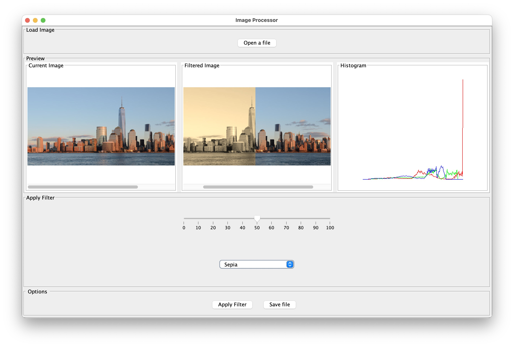

- Color Correct Operation
  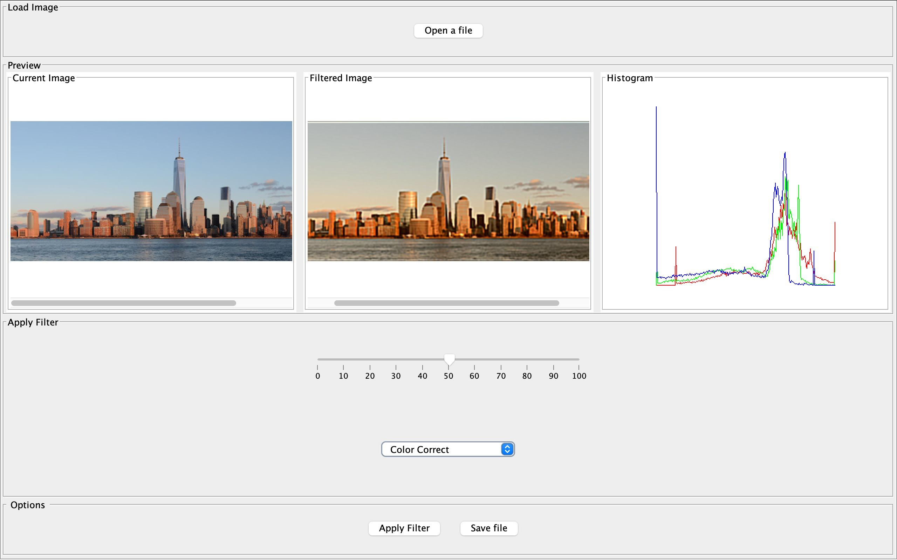

- Greyscale Operation
  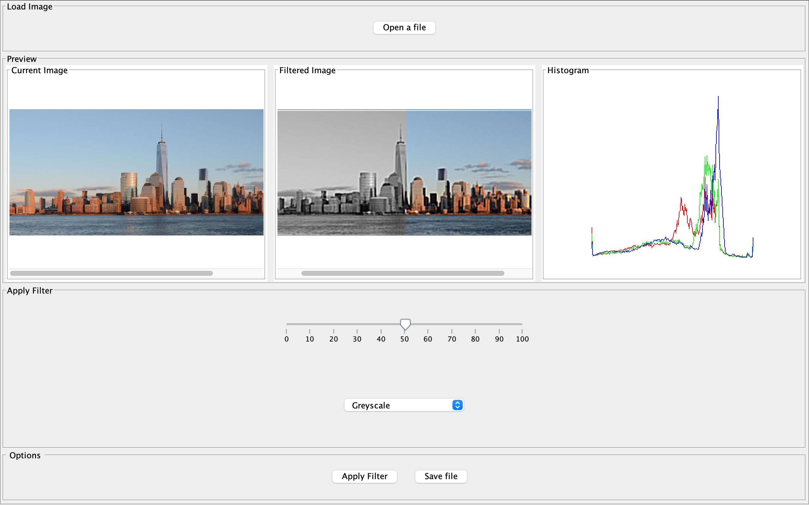

- Adjust Levels Operation
  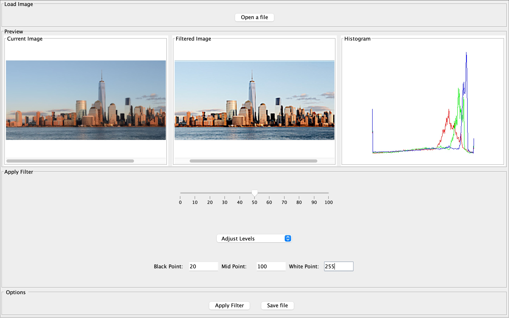

- Horizontal Flip, Vertical Flip
- 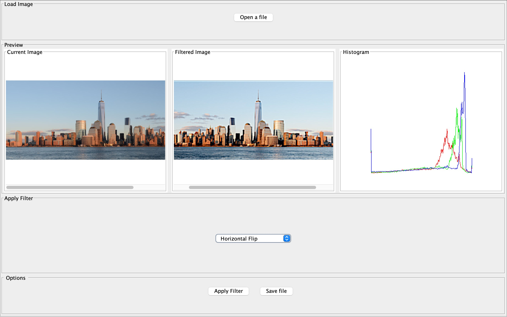
  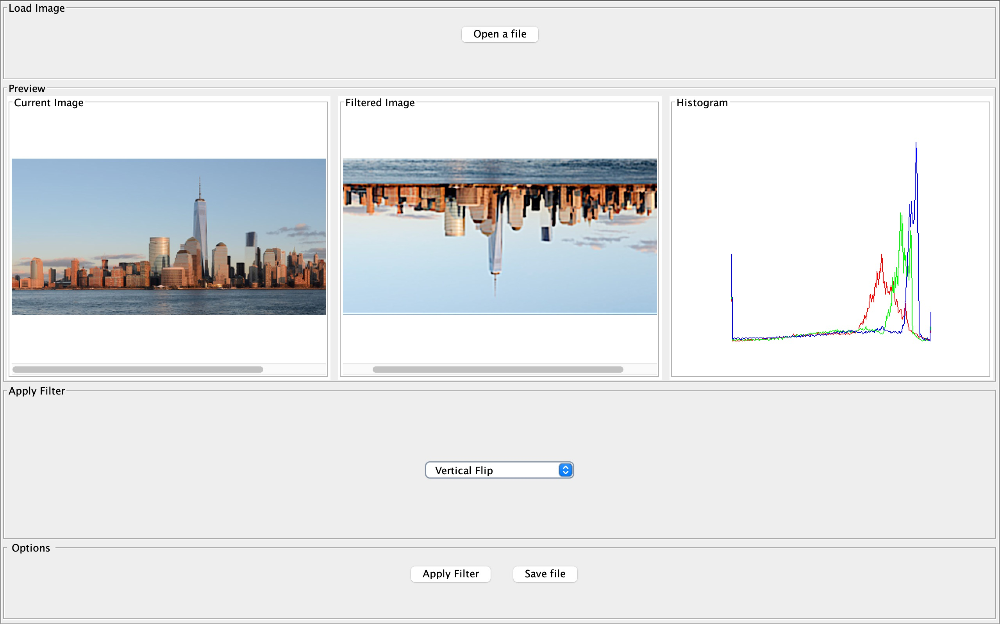

- Color Components
  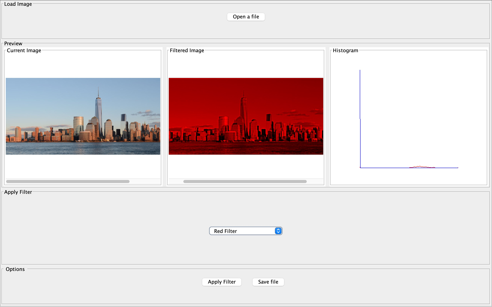
  
  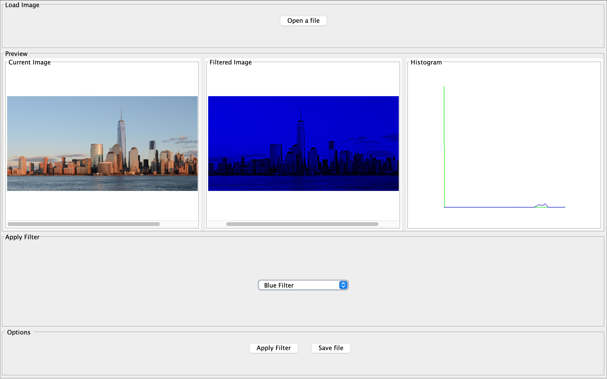

- Blur, Sharpen
  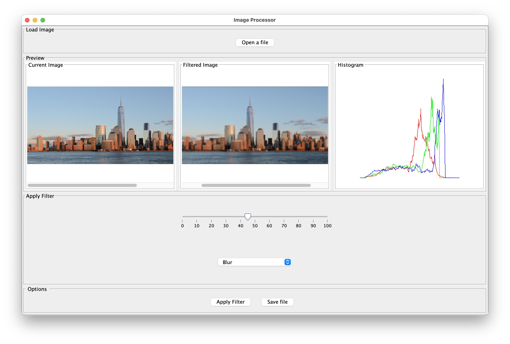
  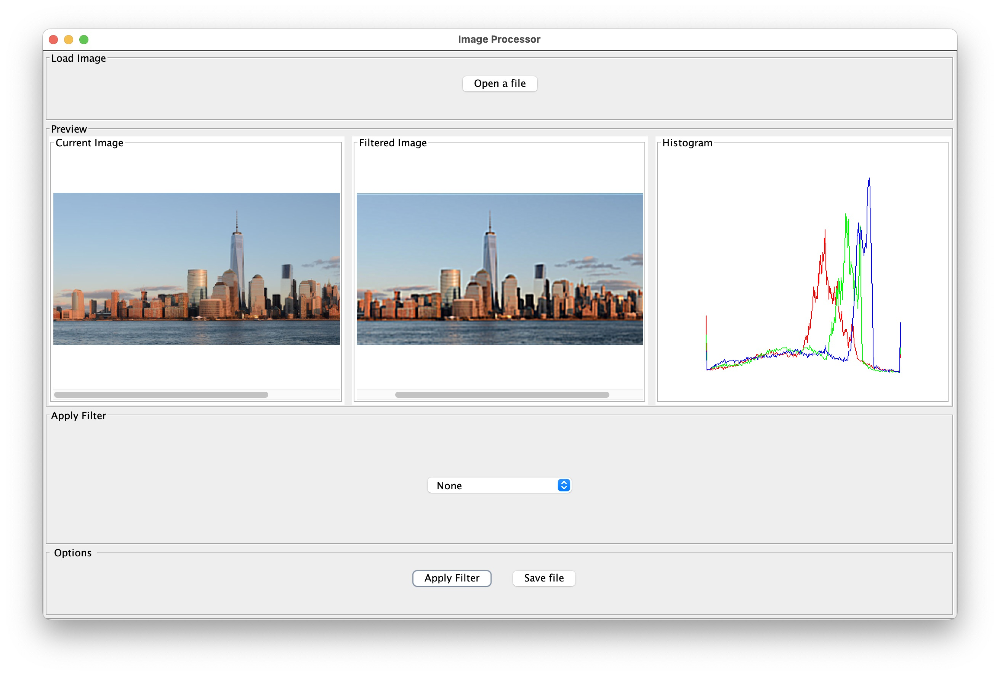

- Compress
  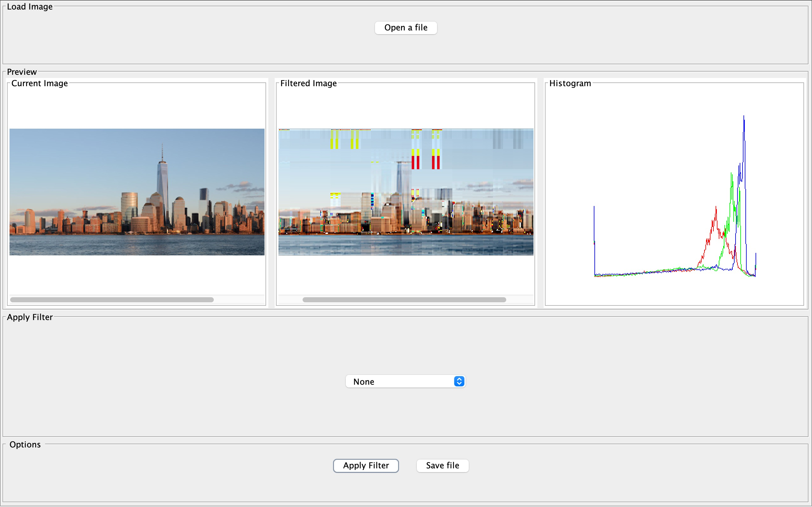

- Dither
  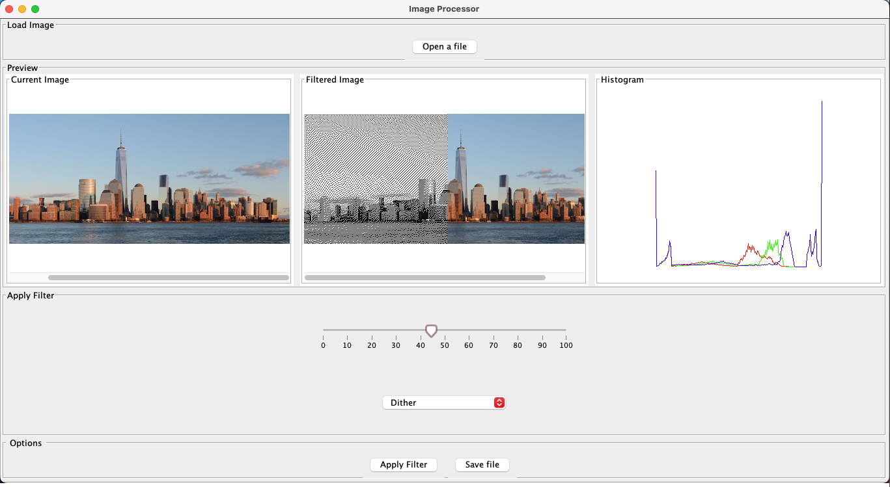

## License

1. Small_4x3.ppm. Self generated image using GIMP 
2. Cute_dog_3x4.jpg. Self generated image using GIMP
3. Cute_dog_3x4.png. Self generated image using GIMP
4. Galaxy.jpg. Retrieved from 
https://northeastern.instructure.com/courses/157051/assignments/1965696 [Assignment 5 Description]
5. Manhattan-small.png. Retrieved from 
https://northeastern.instructure.com/courses/157051/assignments/1965696 [Assignment 5 Description]
6. diya.png - self captured image
